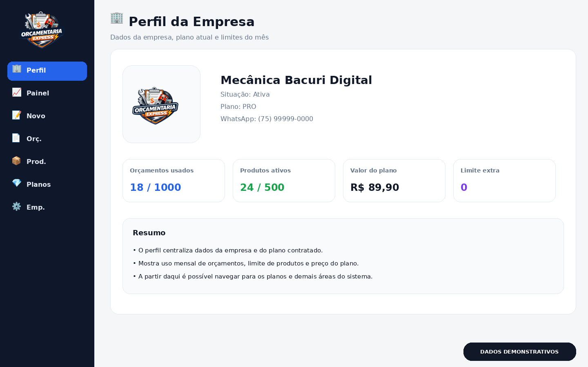
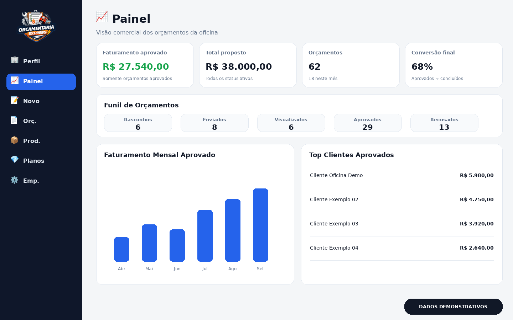
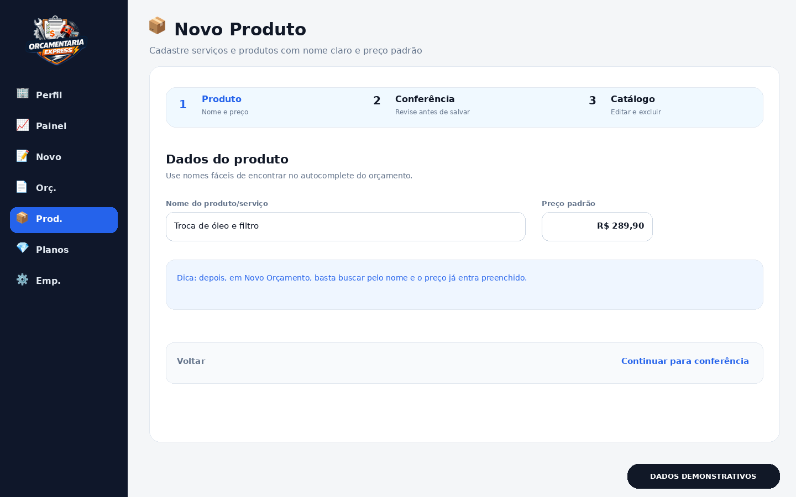
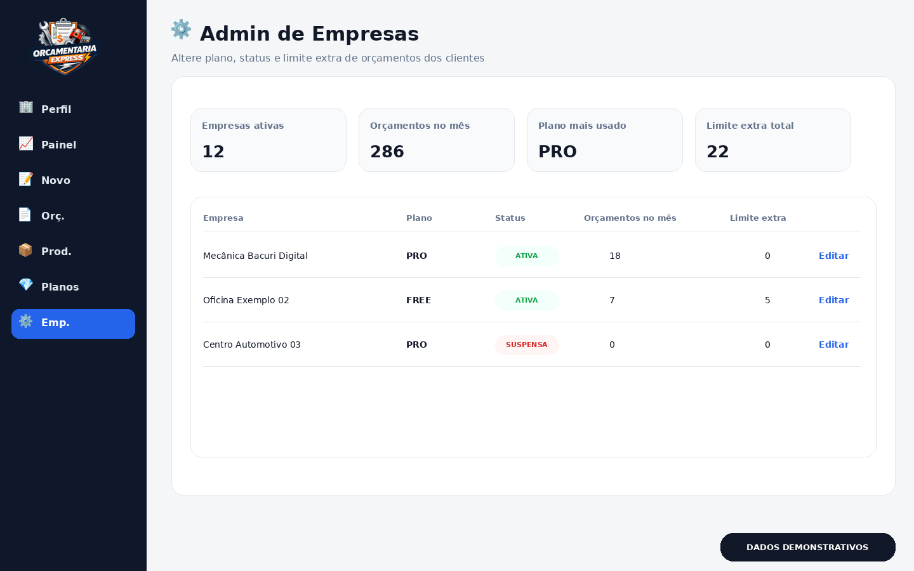

# 🔧 Orçamentaria Express — Mecânica

Sistema web de **orçamentos profissionais para oficinas mecânicas e centros automotivos**, desenvolvido pela **Bacuri Digital**.

A plataforma organiza o fluxo comercial da oficina: criação da proposta, catálogo de produtos/serviços, geração de PDF, compartilhamento, aprovação eletrônica e acompanhamento de conversão.

🌐 **Apresentação:** https://www.mecanica.bacuridigital.com/landing-page.php

> Os screenshots abaixo usam **dados demonstrativos** para não expor clientes, telefones, valores ou tokens reais.

---

## 🏢 Perfil da Empresa



Área de configuração e acompanhamento da empresa, com informações do plano contratado, consumo mensal de orçamentos e quantidade de produtos ativos.

## 📈 Painel



Visão comercial com faturamento aprovado, total proposto, volume de orçamentos, funil por status, taxa de conversão, evolução mensal e principais clientes.

## 📝 Novo Orçamento


Fluxo em três etapas: **Cliente → Itens → Revisão**. O operador informa nome e WhatsApp, adiciona serviços ou produtos e revisa a proposta antes de salvar.

## 📦 Novo Produto



Cadastro de produtos e serviços reutilizáveis. O preço padrão pode ser alterado em um orçamento específico sem modificar o cadastro principal.

## 📄 Orçamentos


Lista de propostas com cliente, valor, status, data e ações como PDF e abertura do link público.

## 💎 Planos


Tela de planos com limites e recursos do modelo SaaS.

| Plano | Orçamentos/mês | Produtos ativos | Preço |
|---|---:|---:|---:|
| FREE | 10 | 20 | R$ 0 |
| PRO | 1.000 | 500 | R$ 89,90 |

## ⚙️ Admin de Empresas



Área administrativa para gerenciamento de empresas da plataforma, com controle de plano, status, consumo mensal e limite extra.

## 🌐 Proposta Pública


O cliente abre um link exclusivo, visualiza itens e total e pode **aprovar ou recusar** sem fazer login.

---

## ✨ Funcionalidades

- criação guiada de orçamentos;
- cadastro e reaproveitamento de clientes;
- catálogo de produtos e serviços;
- quantidade e preço ajustáveis por proposta;
- preservação do histórico dos itens do orçamento;
- geração de PDF;
- link público da proposta;
- aprovação e recusa eletrônica;
- status `visualizado`;
- dashboard com métricas e conversão;
- duplicação de orçamento;
- gestão de produtos;
- planos FREE e PRO;
- autenticação por e-mail/senha;
- autenticação Google OAuth;
- estrutura multitenant;
- integração com WhatsApp;
- PWA com `manifest.json` e `service-worker.js`.

---

## 🛠️ Ajustes feitos no sistema

Foram preparados também os arquivos ajustados do sistema para refletir o que você pediu:

- **ícone em “📦 Novo Produto”** no próprio sistema;
- **padronização do tamanho dos títulos** para combinar com as demais páginas;
- alinhamento dos ícones usados em navegação e títulos.

Arquivos incluídos no pacote:

```text
arquivos-sistema-ajustados/core/layout.php
arquivos-sistema-ajustados/public/produto.php
arquivos-sistema-ajustados/public/novo_orcamento.php
```

---

## 📂 Estrutura dos screenshots

```text
docs/
└── screenshots/
    ├── perfil-empresa.png
    ├── painel.png
    ├── novo-orcamento.png
    ├── novo-produto.png
    ├── orcamentos.png
    ├── planos.png
    ├── admin-empresas.png
    └── proposta-publica.png
```

---

## 🏢 Bacuri Digital

**Orçamentaria Express** é um produto da **Bacuri Digital**.

© 2026 Bacuri Digital. Todos os direitos reservados.
