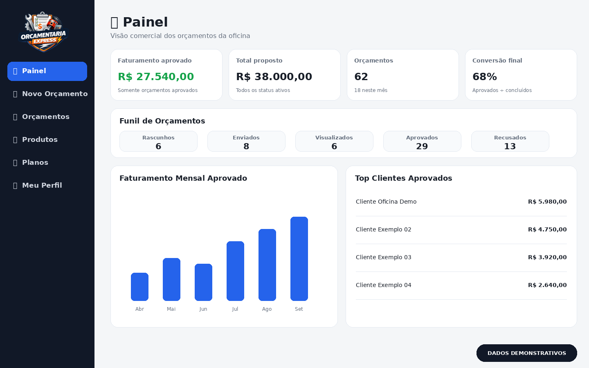
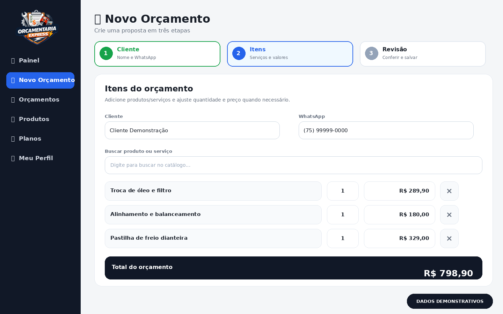
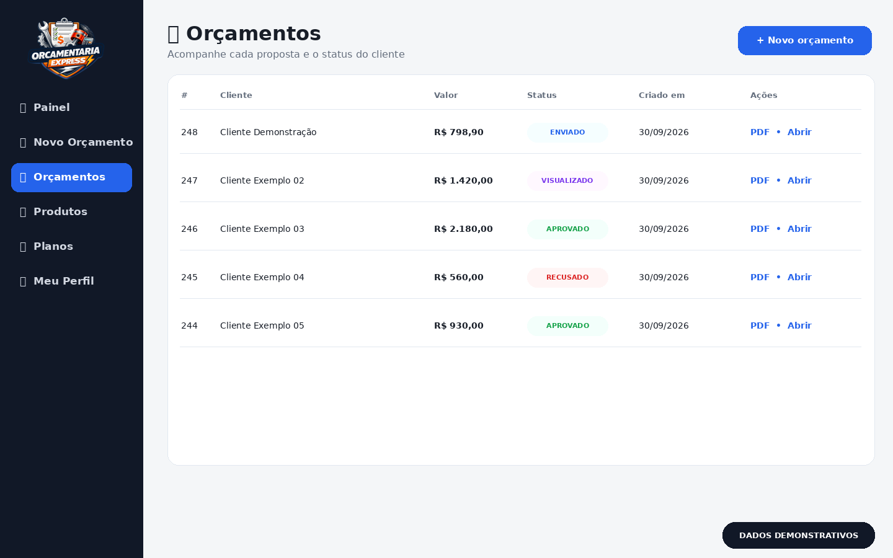
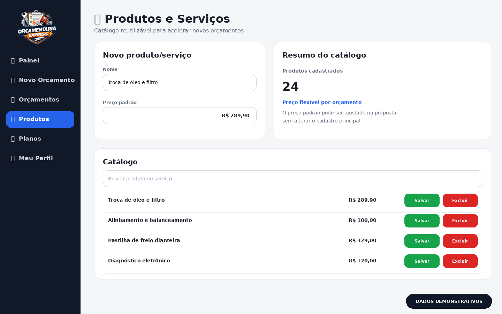
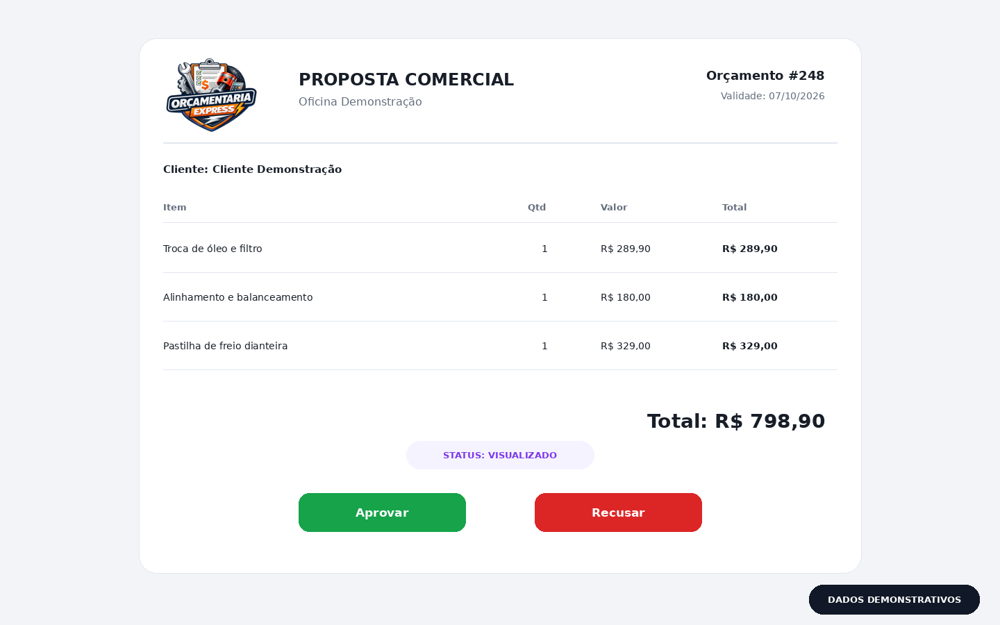
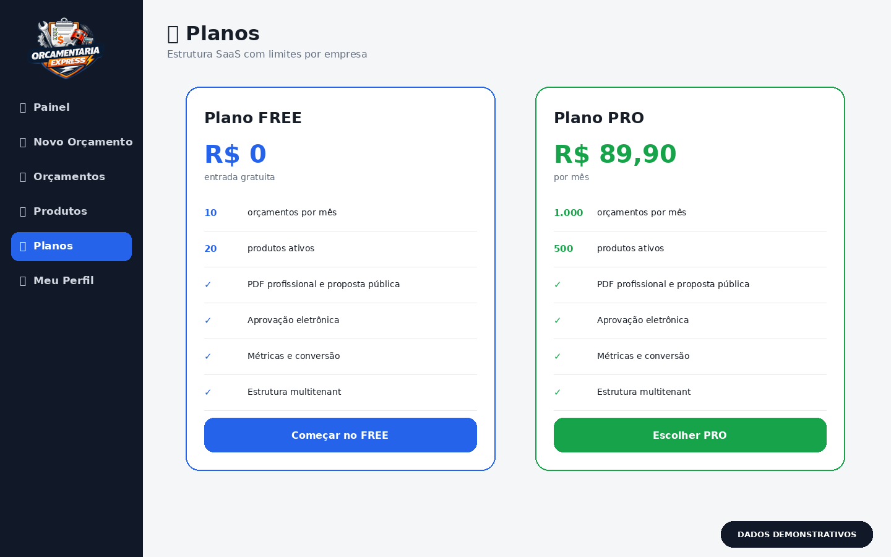

# 🔧 Orçamentaria Express — Mecânica

Sistema web de **orçamentos profissionais para oficinas mecânicas e centros automotivos**, desenvolvido pela **Bacuri Digital**.

A plataforma organiza o fluxo comercial da oficina: criação da proposta, catálogo de produtos/serviços, geração de PDF, compartilhamento, aprovação eletrônica e acompanhamento de conversão.

🌐 **Apresentação:** https://www.mecanica.bacuridigital.com/landing-page.php

> Os screenshots abaixo usam **dados demonstrativos** para não expor clientes, telefones, valores ou tokens reais.

---

## 📸 Visão do sistema

### Dashboard comercial



O painel reúne faturamento aprovado, total proposto, quantidade de orçamentos, conversão final, funil por status, evolução mensal e clientes com maior volume aprovado.

### Novo orçamento



Fluxo em três etapas: **Cliente → Itens → Revisão**. O operador informa nome/WhatsApp, adiciona produtos ou serviços e pode ajustar quantidade e preço antes de salvar ou enviar.

### Gestão de orçamentos



Lista centralizada com cliente, valor, status, data e ações. O fluxo previsto no código contempla `rascunho`, `enviado`, `visualizado`, `aprovado` e `recusado`.

### Produtos e serviços



Catálogo reutilizável para agilizar novos atendimentos. O preço padrão pode ser alterado em um orçamento específico sem alterar o cadastro principal.

### Proposta pública



O cliente abre um link exclusivo, visualiza itens e total e pode **aprovar ou recusar** sem fazer login. Quando uma proposta enviada é aberta, o sistema pode registrar o status como visualizado.

### Planos SaaS



A landing page atual define os planos:

| Plano | Orçamentos/mês | Produtos ativos | Preço |
|---|---:|---:|---:|
| FREE | 10 | 20 | R$ 0 |
| PRO | 1.000 | 500 | R$ 89,90 |

---

## ✨ Funcionalidades encontradas no código

- criação guiada de orçamentos;
- cadastro e reaproveitamento de clientes;
- catálogo de produtos e serviços;
- quantidade e preço ajustáveis por proposta;
- snapshots de nome, preço e quantidade nos itens do orçamento;
- geração de PDF;
- link público de proposta;
- aprovação e recusa eletrônica;
- atualização para status `visualizado`;
- dashboard de faturamento, proposta, ticket e conversão;
- funil de orçamentos;
- duplicação de orçamento;
- gestão de produtos;
- planos FREE e PRO;
- autenticação por e-mail/senha;
- autenticação Google OAuth;
- estrutura multitenant por empresa;
- área administrativa para empresas;
- integração/fluxo de WhatsApp;
- PWA com `manifest.json` e `service-worker.js`.

---

## 📊 Dados técnicos do projeto analisado

O pacote analisado contém, fora de `.git` e `vendor`:

| Item | Quantidade |
|---|---:|
| Arquivos próprios do projeto | 71 |
| Páginas PHP em `public/` | 16 |
| Endpoints PHP em `public/api/` | 15 |
| Módulos PHP em `core/` | 8 |
| Folhas CSS em `css/` | 9 |
| Imagens em `public/imagens/` | 5 |

Entidades/tabelas referenciadas no código:

`empresas`, `usuarios`, `clientes`, `produtos`, `modelos_produtos`, `orcamentos`, `orcamento_itens` e `planos`.

---

## 🔄 Fluxo comercial

```text
Cliente
  ↓
Itens / serviços
  ↓
Revisão
  ↓
Salvar / Enviar
  ↓
PDF + link público
  ↓
Visualizado
  ↓
Aprovado / Recusado
  ↓
Dashboard e conversão
```

---

## 🔐 Configuração segura

Credenciais reais devem permanecer somente em:

```text
config/env.local.php
```

Esse arquivo não deve ser versionado.

Arquivos adequados para o Git:

```text
config/env.php
config/db.php
config/env.example.php
```

O `env.example.php` deve conter **apenas valores fictícios**.

---

## ⚙️ Tecnologias

- PHP 8+
- MySQL / MariaDB
- PDO
- HTML5 / CSS3 / JavaScript
- Bootstrap
- Composer
- Dompdf
- Google OAuth
- arquitetura multitenant
- PWA (`manifest.json` + `service-worker.js`)

---

## 📂 Estrutura principal

```text
mecanica/
├── config/
├── core/
├── css/
├── public/
│   ├── admin/
│   ├── api/
│   ├── assets/
│   ├── imagens/
│   └── pages/
├── composer.json
├── composer.lock
├── manifest.json
├── service-worker.js
└── README.md
```

---

## 🏢 Bacuri Digital

**Orçamentaria Express** é um produto da **Bacuri Digital**.

© 2026 Bacuri Digital. Todos os direitos reservados.
